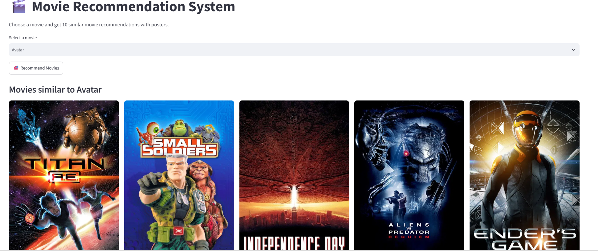

# 🎬 Movie Recommendation System

A **Content-Based Movie Recommendation System** built with **Python, Machine Learning, and Streamlit**. The application recommends the **Top 10 movies similar to a user-selected movie** based on movie metadata and displays their posters using the **TMDB API**.

## 📌 Project Overview

The Movie Recommendation System helps users discover movies similar to their favorite titles.

The system analyzes movie metadata including:

* Movie Overview
* Genres
* Keywords
* Cast
* Director

These features are combined into a single text representation and transformed into numerical vectors using **CountVectorizer**. **Cosine Similarity** is then used to calculate the similarity between movies and generate recommendations.

The application is developed using **Streamlit** to provide a simple and interactive user interface.

## ✨ Key Features

* 🎬 Select a movie from an interactive dropdown
* 🤖 Generate **Top 10 similar movie recommendations**
* 🖼️ Display movie posters
* 🔍 Content-based recommendation approach
* 📊 Cosine Similarity for recommendation ranking
* 🌐 Interactive Streamlit web application
* 🎞️ Movie posters retrieved through the TMDB API

## 🛠️ Technologies & Tools

* **Programming Language:** Python
* **Data Processing:** Pandas
* **Machine Learning:** Scikit-learn
* **Vectorization:** CountVectorizer
* **Similarity Algorithm:** Cosine Similarity
* **Web Framework:** Streamlit
* **API:** TMDB API
* **HTTP Requests:** Requests

## 📂 Dataset

This project uses the **TMDB 5000 Movie Dataset**, containing movie metadata and credits.

### Dataset Files

```text
tmdb_5000_movies.csv
tmdb_5000_credits.csv
```

**Dataset Source:**
TMDB Movie Metadata – Kaggle

## ⚙️ Recommendation Workflow

```text
Movie Dataset
      ↓
Data Cleaning & Preprocessing
      ↓
Merge Movie & Credits Data
      ↓
Feature Extraction
      ↓
Create Movie Tags
      ↓
CountVectorizer
      ↓
Cosine Similarity
      ↓
Top 10 Similar Movies
      ↓
TMDB API
      ↓
Movie Posters
```

### Step-by-Step Process

1. Load the movie and credits datasets.
2. Merge the datasets using the movie ID.
3. Extract relevant features such as genres, keywords, cast, director, and overview.
4. Combine the selected features into a `tags` column.
5. Convert the movie tags into numerical vectors using **CountVectorizer**.
6. Calculate movie-to-movie similarity using **Cosine Similarity**.
7. Rank movies based on similarity scores.
8. Select the **Top 10 similar movies**.
9. Fetch movie posters using the **TMDB API**.
10. Display the recommendations through the Streamlit interface.

## 📦 Installation & Setup

### 1. Clone the Repository

```bash
git clone https://github.com/Rupasreesurapaneni777/Movie-Recommendation-System.git
```

### 2. Navigate to the Project Directory

```bash
cd Movie-Recommendation-System
```

### 3. Create a Virtual Environment

```bash
python -m venv .venv
```

### 4. Activate the Virtual Environment

**Windows:**

```bash
.venv\Scripts\activate
```

### 5. Install Dependencies

```bash
pip install -r requirements.txt
```

Alternatively:

```bash
pip install streamlit pandas scikit-learn requests
```

## 🔑 TMDB API Configuration

The application uses the **TMDB API** to retrieve movie posters.

Create a TMDB API key and configure it in the application as required by `app.py`.

**Important:** Do not upload your API key directly to GitHub. Store sensitive credentials using environment variables or another secure configuration method.

## ▶️ Run the Application

Start the Streamlit application using:

```bash
python -m streamlit run app.py
```

The application will be available at:

```text
http://localhost:8501
```

## 🖥️ Application Output

The user selects a movie from the dropdown and clicks **Recommend Movies**.

The application then displays the **Top 10 similar movies along with their posters**.

### Example



The system successfully generates movie recommendations using **content-based filtering and cosine similarity**.

## 📁 Project Structure

```text
Movie-Recommendation-System/
│
├── app.py
├── Movie_Recommendation_System.ipynb
├── tmdb_5000_movies.csv
├── tmdb_5000_credits.csv
├── requirements.txt
├── output.png
├── README.md
└── .gitignore
```

## 🧠 Machine Learning Approach

### Content-Based Filtering

This project uses **Content-Based Filtering**, where recommendations are generated based on similarities between movie attributes rather than user ratings.

### CountVectorizer

`CountVectorizer` converts the combined movie metadata into numerical feature vectors that can be processed by the recommendation algorithm.

### Cosine Similarity

Cosine Similarity measures the similarity between movie vectors. Movies with higher similarity scores are ranked higher and selected as recommendations.

## 📊 Results

The system is capable of:

* Processing movie metadata
* Extracting relevant movie features
* Calculating movie similarities
* Generating Top 10 recommendations
* Retrieving movie posters through an API
* Providing an interactive recommendation interface

## 🚀 Future Enhancements

* ⭐ Add movie ratings
* 📝 Display detailed movie descriptions
* 🎭 Add genre and release-year filters
* 🎬 Integrate movie trailer links
* 🔎 Improve movie search functionality
* 🤝 Implement collaborative filtering
* ☁️ Deploy the application online

## 📚 References

* TMDB Movie Dataset – Kaggle
* Streamlit Documentation
* Scikit-learn Documentation
* TMDB API Documentation

## 📄 License

This project is licensed under the **MIT License**.
